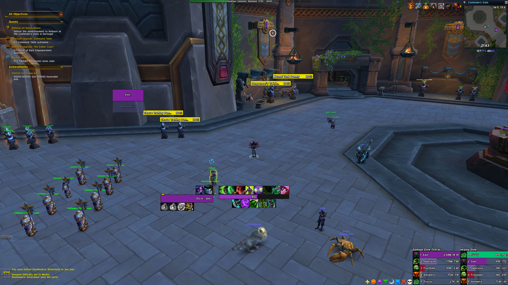

# WoW Midnight UI by Aiko

Короткая инструкция для интерфейса WoW Midnight.

- Поддерживается разрешение `2k`; масштаб интерфейса — `0.58`.

## Профили

- [Blizzard Edit Mode](https://github.com/aiko-zxc/wow-ui/blob/main/midnight/blizz.txt)
- [EUI / EllesmereUI](https://github.com/aiko-zxc/wow-ui/blob/main/midnight/eui.txt)
- [BigWigs](https://github.com/aiko-zxc/wow-ui/blob/main/midnight/big-wigs.txt)
- [Targeted Spells — Party](https://github.com/aiko-zxc/wow-ui/blob/main/midnight/targeted-spells-party.txt)
- [Targeted Spells — Player](https://github.com/aiko-zxc/wow-ui/blob/main/midnight/targeted-spells-player.txt)

## Аддоны

- EUI / EllesmereUI
- BigWigs
- Targeted Spells
- Midnight Focus Interrupt
- SharedMedia_Causese
- GroupFinderRIO
- Premade Groups Filter
- GroupfinderFlags
- Syndicator
- BlizzMove
- Teleport Menu
- Class Codex
- MeleeRangeIndicator
- MRT / Method Raid Tools
- MDT / Mythic Dungeon Tools
- MPlusTimer
- City Guide
- BugSack
- BugGrabber
- BetterAddonList
- True Stat Values
- Simulationcraft
- Addon Usage

## После установки

Чтобы отключить звук ошибок BugSack:

`Escape` → `Options` → `Addons` → `BugSack` → `Mute`.